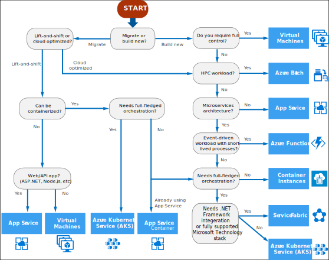

# Develop Azure Compute Solutions (25-30%)



## Implement Infrastructure-as-a-Service (IaaS) solutions

 * provision individual VMs along with the associated networking and storage components
 * Deploy whatever software and applications you want onto those VMs
* You still manage the individual VMs inside an Azure virtual network

### provision VMs

### configure VMs for remote access 

### create ARM templates 

### create container images for solutions by using Docker 

### publish an image to the Azure Container Registry 

### run containers by using Azure Container Instance 


## Create Azure App Service Web Apps

* Azure App Service for hosting web apps, mobile app back ends, RESTful APIs, or automated business processes
* No need to manage VMs or networking resources

### create an Azure App Service Web App

### enable diagnostics logging

### deploy code to a web app

### configure web app settings including SSL, API, and connection strings

### implement autoscaling rules, including scheduled autoscaling, and scaling by operational or system metrics


## Implement Azure functions

A managed Functions-as-a-Service (FaaS) environment. Run small pieces of code without worrying about application infrastructure.

### Implement Input and Output Bindings for a Function

* Triggers cause a function to run
* A function must have exactly one trigger
* Triggers have associated data provided as the payload to the function
* Binding declaratively connects another resource to the function
    * input binding
    * output binding
    * both
* Binding data is provided to the function as parameters

#### Examples:

1. A new queue message arrives which runs a function to write to another queue.
2. A scheduled job reads Blob Storage contents and creates a new Cosmos DB document.
3. The Event Grid is used to read an image from Blob Storage and a document from Cosmos DB to send an email.
4. A webhook that uses Microsoft Graph to update an Excel sheet.


#### Answers (Trigger, Input binding, Output binding):

1. Queue, none, Queue
2. I: Timer, Blob Storage, Cosmos DB
3. Event Grid, Blob storage and Cosmos DB, SendGrid
4. HTTP, none, MS Graph

* In a C# class library function triggers and bindings are defined by decorating methods and parameters with C# attributes
* In all other implementations the `function.json` file is updated
* Triggers and binding have a `direction` property
    * Triggers: always `in`
    * Input and Output bindings: `in` and `out`
    * Some bindings support `inout` (some Blob types)
    * When you use attributes in a class libary the direction is provided in an attribute constructor or inferred from the parameter type

Example:  Write a new row to Azure Table storage whenever a new message appears in Azure Queue storage.

```json
{
  "bindings": [
    {
      "type": "queueTrigger",
      "direction": "in",
      "name": "order",
      "queueName": "myqueue-items",
      "connection": "MY_STORAGE_ACCT_APP_SETTING"
    },
    {
      "type": "table",
      "direction": "out",
      "name": "$return",
      "tableName": "outTable",
      "connection": "MY_TABLE_STORAGE_ACCT_APP_SETTING"
    }
  ]
}
```

### Implement Function Triggers by Using Data Operations, Timers, and Webhooks

https://docs.microsoft.com/en-us/azure/azure-functions/functions-triggers-bindings?tabs=csharp

#### Data Operations

* Queue
* Blob Storage
* Azure Cosmos DB
* Event Hubs
* ...

Blob storage

| Action | Type |
|---|---|
| Run a function as blob storage data changes | Trigger |
| Read blob storage data in a function | Input binding |
| Allow a function to write blob storage data | Output binding |

Trigger

````c#
[FunctionName("BlobTriggerCSharp")]        
public static void Run([BlobTrigger("samples-workitems/{name}")] Stream myBlob, string name, ILogger log)
{
    log.LogInformation($"C# Blob trigger function Processed blob\n Name:{name} \n Size: {myBlob.Length} Bytes");
}
````

Input

````c#
[FunctionName("BlobInput")]
public static void Run(
    [QueueTrigger("myqueue-items")] string myQueueItem,
    [Blob("samples-workitems/{queueTrigger}", FileAccess.Read)] Stream myBlob,
    ILogger log)
{
    log.LogInformation($"BlobInput processed blob\n Name:{myQueueItem} \n Size: {myBlob.Length} bytes");
}
````

Output

Function triggered by the creation of an image blob in the `sample-images container`. It creates small and medium size copies of the image blob.

````c#
 [FunctionName("ResizeImage")]
public static void Run([BlobTrigger("sample-images/{name}")] Stream image,
    [Blob("sample-images-sm/{name}", FileAccess.Write)] Stream imageSmall,
    [Blob("sample-images-md/{name}", FileAccess.Write)] Stream imageMedium)
{
  ...
````

#### Timer

NCRONTAB schedule

`{second} {minute} {hour} {day} {month} {day-of-week}`

| Example | When triggered |
|---|---|
| "0 */5 * * * *" | once every five minutes |
| "0 0 * * * *" | once at the top of every hour |
|"0 0 9-17 * * *" | once every hour from 9 AM to 5 PM|
|"0 30 9 * * *" | at 9:30 AM every day|
|"0 30 9 * * 1-5" | at 9:30 AM every weekday|
|"0 30 9 * Jan Mon" | at 9:30 AM every Monday in January|

````c#
[FunctionName("TimerTriggerCSharp")]
public static void Run([TimerTrigger("0 */5 * * * *")]TimerInfo myTimer, ILogger log)
{
    if (myTimer.IsPastDue)
    {
        log.LogInformation("Timer is running late!");
    }
    log.LogInformation($"C# Timer trigger function executed at: {DateTime.Now}");
}
````

#### Webhook

* Http (trigger)
* "user-defined HTTP callbacks" (output binding)

````c#
[FunctionName("HttpTriggerCSharp")]
public static async Task<IActionResult> Run(
    [HttpTrigger(AuthorizationLevel.Function, "get", "post", Route = null)]
    HttpRequest req, ILogger log)
{
    log.LogInformation("C# HTTP trigger function processed a request.");

    string name = req.Query["name"];

    string requestBody = await new StreamReader(req.Body).ReadToEndAsync();
    dynamic data = JsonConvert.DeserializeObject(requestBody);
    name = name ?? data?.name;

    return name != null
        ? (ActionResult)new OkObjectResult($"Hello, {name}")
        : new BadRequestObjectResult("Please pass a name on the query string or in the request body");
}
````

````json
{
    "extensions": {
        "http": {
            "routePrefix": "api",
            "maxOutstandingRequests": 200,
            "maxConcurrentRequests": 100,
            "dynamicThrottlesEnabled": true,
            "hsts": {
                "isEnabled": true,
                "maxAge": "10"
            },
            "customHeaders": {
                "X-Content-Type-Options": "nosniff"
            }
        }
    }
}
````

### Implement Azure Durable Functions

Durable Functions is an extension of Azure Functions that lets you write stateful functions in a serverless compute environment

* stateful workflows: orchestrator functions (coordinate the execution of other Durable functions within a function app)
* stateful entities: entity functions (reading and updating small pieces of state)

The primary use case for Durable Functions is simplifying complex, stateful coordination requirements in serverless applications.

#### Function Chaining

Asequence of functions executes in a specific order. In this pattern, the output of one function is applied to the input of another function.

````c#
[FunctionName("Chaining")]
public static async Task<object> Run(
    [OrchestrationTrigger] IDurableOrchestrationContext context)
{
    try
    {
        var x = await context.CallActivityAsync<object>("F1", null);
        var y = await context.CallActivityAsync<object>("F2", x);
        var z = await context.CallActivityAsync<object>("F3", y);
        return  await context.CallActivityAsync<object>("F4", z);
    }
    catch (Exception)
    {
        // Error handling or compensation goes here.
    }
}
````

You can use the `context` parameter to invoke other functions by name, pass parameters, and return function output. Each time the code calls `await`, the Durable Functions framework checkpoints the progress of the current function instance. If the process or virtual machine recycles midway through the execution, the function instance resumes from the preceding `await` call.

#### Fan-out/Fan-in

Execute multiple functions in parallel and then wait for all functions to finish.

````c#
[FunctionName("FanOutFanIn")]
public static async Task Run(
    [OrchestrationTrigger] IDurableOrchestrationContext context)
{
    var parallelTasks = new List<Task<int>>();

    // Get a list of N work items to process in parallel.
    object[] workBatch = await context.CallActivityAsync<object[]>("F1", null);
    for (int i = 0; i < workBatch.Length; i++)
    {
        Task<int> task = context.CallActivityAsync<int>("F2", workBatch[i]);
        parallelTasks.Add(task);
    }

    await Task.WhenAll(parallelTasks);

    // Aggregate all N outputs and send the result to F3.
    int sum = parallelTasks.Sum(t => t.Result);
    await context.CallActivityAsync("F3", sum);
}
````

The Fan-out can be accomplished with a queue and normal functions, but the fan-in can be challenging (track when the queue-triggered functions end, and then store function outputs.)

The fan-out work is distributed to multiple instances of the `F1` function. The work is tracked by using a dynamic list of tasks. `Task.WhenAll` is called to wait for all the called functions to finish. Then, the `F2` function outputs are aggregated from the dynamic task list and passed to the `F3` function.

The automatic checkpointing that happens at the await call on `Task.WhenAll` ensures that a potential midway crash or reboot doesn't require restarting an already completed task.

#### Async HTTP APIs

Addresses the problem of coordinating the state of long-running operations with external clients. A common way to implement this pattern is by having an HTTP endpoint trigger the long-running action. Then, redirect the client to a status endpoint that the client polls to learn when the operation is finished.

Durable Functions provides built-in support for this pattern, exposing built-in HTTP APIs that manage long-running orchestrations.

#### Monitoring

The monitor pattern refers to a flexible, recurring process in a workflow. An example is polling until specific conditions are met. You can use a regular timer trigger to address a basic scenario, such as a periodic cleanup job, but its interval is static and managing instance lifetimes becomes complex.

Durable Functions can implement multiple monitors that observe arbitrary endpoints. The monitors can end execution when a condition is met, or another function can use the durable orchestration client to terminate the monitors. You can change a monitor's wait interval based on a specific condition (for example, exponential backoff.)


#### Human interaction

Automated processes involving human interaction are not highly available and as responsive as cloud services. An automated process might allow for this interaction by using timeouts and compensation logic.

You can use a durable timer and a branching process that waits for an external event

External events are one-way asynchronous operations. They are not suitable for situations where the client sending the event needs a synchronous response from the orchestrator function.

#### Aggregator (stateful entities)

Aggregating event data over a period of time into a single, addressable entity.

The aggregator might need to take action on event data as it arrives, and external clients may need to query the aggregated data.

 Implement this pattern with normal, stateless functions makes concurrency control a huge challenge.
 
 * multiple threads modifying the same data at the same time
 * the aggregator only runs on a single VM at a time.

 Durable Entities:

 ````c#
 [FunctionName("Counter")]
public static void Counter([EntityTrigger] IDurableEntityContext ctx)
{
    int currentValue = ctx.GetState<int>();
    switch (ctx.OperationName.ToLowerInvariant())
    {
        case "add":
            int amount = ctx.GetInput<int>();
            ctx.SetState(currentValue + amount);
            break;
        case "reset":
            ctx.SetState(0);
            break;
        case "get":
            ctx.Return(currentValue);
            break;
    }
}
 ````

#### Create a Durable Function

VS 2019 > New > Project > Azure Functions > Empty

Add > New Azure Function > Azure Function > Add

Durable Functions Orchestration > OK


````c#
public static class Function1
{
    [FunctionName("Function1")]
    public static async Task<List<string>> RunOrchestrator(
        [OrchestrationTrigger] IDurableOrchestrationContext context)
    {
        var outputs = new List<string>();

        // Replace "hello" with the name of your Durable Activity Function.
        outputs.Add(await context.CallActivityAsync<string>("Function1_Hello", "Tokyo"));
        outputs.Add(await context.CallActivityAsync<string>("Function1_Hello", "Seattle"));
        outputs.Add(await context.CallActivityAsync<string>("Function1_Hello", "London"));

        // returns ["Hello Tokyo!", "Hello Seattle!", "Hello London!"]
        return outputs;
    }

    [FunctionName("Function1_Hello")]
    public static string SayHello([ActivityTrigger] string name, ILogger log)
    {
        log.LogInformation($"Saying hello to {name}.");
        return $"Hello {name}!";
    }

    [FunctionName("Function1_HttpStart")]
    public static async Task<HttpResponseMessage> HttpStart(
        [HttpTrigger(AuthorizationLevel.Anonymous, "get", "post")] HttpRequestMessage req,
        [DurableClient] IDurableOrchestrationClient starter,
        ILogger log)
    {
        // Function input comes from the request content.
        string instanceId = await starter.StartNewAsync("Function1", null);
        log.LogInformation($"Started orchestration with ID = '{instanceId}'.");
        return starter.CreateCheckStatusResponse(req, instanceId);
    }
}
````
