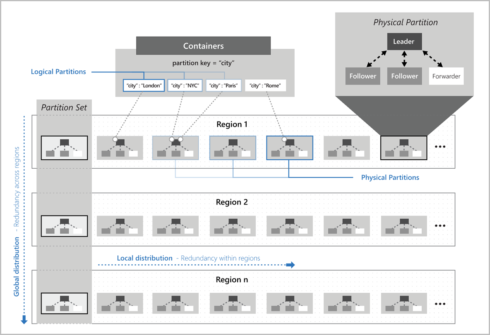

# Develop for Azure Storage (10-15%)

## Develop Solutions That Use Cosmos DB Storage

* Responsive and available Database
	* transparent replication, with management of regions
	* high availability reads/writes
	* transparent horizontal partitioning
	* master-master replication with consistency choices:
		* strong: linearizability guarantee; reads return most recent committed version
		* bounded staleness: reads lag writes by at most K versions or T time interval, whichever is reached first. low write latency & total global order guarantee
		* session: within a session like strong, outside session  but same region consistent prefix, writing to multiple regions: eventual.
		* consistent prefix: reads never see out-of-order writes. 
		* eventual: no ordering guarantee for reads. Replicas will eventually converge without further writes.

* Geo-Redundancy: replicated version of database in a second (paired) region.
* Multi-region Writes: enables concurrent writes to multiple regions

### Select the appropriate API for your solution

Cosmos DB stores data in atom-record-sequence (ARS) format. Data is abstracted and projected as an API which you specify when creating the database.

#### Core (SQL) API

* Default API
* Data view resembling a traditional NoSQL document store
	* JSON documents
	* SQL-like syntax:
		* SELECT, FROM, WHERE, BETWEEN, COUNT, SUM, MIN, MAX, ORDER BY
	* JS type system, expression evaluation and function invocation

```JSON
{
    "id": "cc410485-e177-4cbf-95e1-708f7d5e9297",
    "productName": "Industrial Saw",
    "description": "Cuts through anything",
    "supplier": "Hammer & Nail Inc",
    "quantity": 261,
    "unitCost": "$10.47",
    "retailPrice": "$29.99",
    "categories" : [
        {"name": "hammers"},
        {"name": "hand tools"}
    ]
}
```

```SQL
SELECT c.productName FROM Items c
```
#### MongoDB API

* MongoDB wire protocol (v3.2)
* existging MongoDB client SDKs, drivers and tools

```JS
db.Items.find({},{productName:1,_id:0})
```

#### Cassandra API

* Cassandra Query Language (CQL) (v4)
* Appears as a partitioned row store
		* CREATE KEYSPACE, CREATE TABLE, ALTER TABLE, USE, INSERT, SELECT, UPDATE, BATCH (Only unlogged commands are supported), DELETE

```SQL
CREATE TABLE Catalog.Items(id text, productName text, description text, supplier text, quantity int, unitCost float, retailPrice float, categories map<text,text>, primary key (id));

SELECT id, productName FROM catalog.items
```

#### Azure Table API

* Azure Table Storage with support for global distribution, high availability, scalable throughput
* Adds support for secondary indices beyond Partition and Row keys
	* Automatically indexes all properties with no index management


```SQL
SELECT i.productName FROM Items i
```

#### Gremlin (graph) API

* Graph-based view over the data
	* data as a vertex (individual item in DB)
	* data as an edge (relationship between items in the database)
* Traversal language for queries (Apache Tinkerpop Gremlin)

Add three vertices (products) and 2 edges (related purchases):

```JS
g.addV('product').property('productName', 'Industrial Saw').property('description', 'Cuts through anything').property('quantity', 261)
g.addV('product').property('productName', 'Belt Sander').property('description', 'Smoothes rough edges').property('quantity', 312)
g.addV('product').property('productName', 'Cordless Drill').property('description', 'Bores holes').property('quantity', 647)

g.V().hasLabel('product').has('productName', 'Industrial Saw').addE('boughtWith').to(g.V().hasLabel('product').has('productName', 'Belt Sander'))
g.V().hasLabel('product').has('productName', 'Industrial Saw').addE('boughtWith').to(g.V().hasLabel('product').has('productName', 'Cordless Drill'))
```

* Queries return a  GraphSON result

Query for products purchased with the industrial saw:

```JS
g.V().hasLabel('product').has('productName', 'Industrial Saw').outE('boughtWith')
```
Related purchase details:

```JS
g.V().hasLabel('product').has('productName', 'Industrial Saw').outE('boughtWith').inV().hasLabel('product')
```

#### Picking an API

|| Core (SQL)  | MongoDB  |  Cassandra |  Azure Table |  Gremlin |
|:---|:---:|:---:|:---:|:---:|:---:|
| New projects being created from scratch  | X  |   |   |   |   |
| Existing MongoDB, Cassandra, Azure Table, or Gremlin data |   | X  | X  | X  | X  |
| Analysis of the relationships between data  |   |   |   |   | X  |
| All other scenarios  |  X |   |   |   |   |

* Changing schemas benefit from traditional document stores
* Relationship-focus good fit with a graph database
* simple key-value pairs (traditionally Redis or Table API) good fit with Core (SQL) API with richer query language and improved indexing


### Implement partitioning schemes

* All data in a partition has the same partition key
* Continuing to add new data to a single server or a single partition will eventually run out of space
* A partition strategy is a __scale out__ or __horizontal scaling__ strategy
* partition key defines the strategy
	* set when you create a container
	* cannot be changed
* organizes data into logical divisions
	* try to even distribute operations across the database
	* __Hot Partition__ is a single partition that receives many more requests than other partitions (creating a bottleneck)
* Storage space for the data associated with a given partition key cannot exceed 20GB (one physical partition)
	* to shrink use a composite key (ex: userID-date)
* Larger number of values for a key => increased scalability
* review top queries for best partition keys on read-heavy workloads (i.e. the WHERE clause values)
* understand transactional needs of write-heavy workloads as the key is the scope for multi-document transactions
* You cannot run stored procedures or triggers across multiple logical partitions

#### Choosing a Partition Key

0. Durable Value (cannot update a property if it is part of key)
1. High Cardinality (good distribution)
2. Even Distribution of Requests (RUs divided evenly across partitions)
3. Even Distribution of Storage (fixed max partition size of 20GB)

### Interact with data using the appropriate SDK


#### Tutorials

[Tutorial: Develop an ASP.NET Core MVC web application with Azure Cosmos DB by using .NET SDK](https://docs.microsoft.com/en-us/azure/cosmos-db/sql-api-dotnet-application?WT.mc_id=thomasmaurer-blog-thmaure)

[Tutorial: Build a .NET console app to manage data in Azure Cosmos DB SQL API account](https://docs.microsoft.com/en-us/azure/cosmos-db/sql-api-get-started?WT.mc_id=thomasmaurer-blog-thmaure)

[Tutorial: Query Azure Cosmos DB by using the SQL API](https://docs.microsoft.com/en-us/azure/cosmos-db/tutorial-query-sql-api?WT.mc_id=thomasmaurer-blog-thmaure)

[Tutorial: Set up Azure Cosmos DB global distribution using the SQL API](https://docs.microsoft.com/en-us/azure/cosmos-db/tutorial-global-distribution-sql-api?WT.mc_id=thomasmaurer-blog-thmaure&tabs=dotnetv2%2Capi-async)

[Tutorial: Develop an ASP.NET Core MVC web application with Azure Cosmos DB by using .NET SDK](https://docs.microsoft.com/en-us/azure/cosmos-db/sql-api-dotnet-application)


### Set the appropriate consistency level for operations

Distributed databases using replication for high availability, low latency or both make a trade-off between read consistency vs. availability, latency and throughput.

Five defined consistency models:

* strong: linearizability guarantee; reads return most recent committed version
* bounded staleness: reads lag writes by at most K versions or T time interval, whichever is reached first. low write latency & total global order guarantee
* session: within a session like strong, outside session  but same region consistent prefix, writing to multiple regions: eventual.
* consistent prefix: reads never see out-of-order writes. 
* eventual: no ordering guarantee for reads. Replicas will eventually converge without further writes.

Configure default consistency at the account level and override it at the client or request level:

````C#
// Override consistency at the client level
documentClient = new DocumentClient(new Uri(endpoint), authKey, connectionPolicy, ConsistencyLevel.Eventual);

// Override consistency at the request level via request options
RequestOptions requestOptions = new RequestOptions { ConsistencyLevel = ConsistencyLevel.Eventual };

var response = await client.CreateDocumentAsync(collectionUri, document, requestOptions);
````

#### SQL API and Table API

* Many real world scenarios map best to session consistency (default)
* stronger consistency combined with low latency: bounded staleness
* eventual consistency with some read consistency: consistent prefix
* less strict consistency than session: consistent prefix
* highest availability and lowest latency: eventual consistency
* higher durability with performance: custom (multi master)

#### Cassandra, MongoDB and Gremlin APIs

* bounded staleness: reads on a previous write with bouuded lag
* strong: like bounded with a window zero. Read on latest committed write
* others: staleness is dependent on workload. High reads may be similar to strong; high writes like eventual

Probabilistically Bounded Staleness (PBS) metric: shows how eventual your eventual consistency is when not using strong consistency. Probability (in milliseconds) of getting strongly consistent reads for a combination of write and read regions.


### Create Cosmos DB containers

More Info:

[Work with databases, containers, and items in Azure Cosmos DB](https://docs.microsoft.com/en-us/azure/cosmos-db/databases-containers-items?WT.mc_id=thomasmaurer-blog-thmaure)


Setting provisioned throughput at a container is the most frequent use-case.

* Reserved only for the container
* evenly distributed across physical partitions
* Azure Cosmos database throughput is shared across all containers in the database.
* Measurement of throughput: __request unit (RU)__
* cost to read a 1KB item ~ 1 RU
* Must provision in advance based on load estimate
* Can change RU allocation up/down
* Guarantees that the number of RUs for a given database operation for the same dataset is deterministic
* When provisioned for a container the RUs are available in each region associated with your account.
* Factors:
	* Item size: size increase => increases RUs
	* Item indexing: non-index option reduces RUs
	* Item property count: increase # properties => increases RUs
	* Indexed properties: index policy on container can limit properties indexed
	* Data consistency: strong and bounded staleness consumer ~ 2x more read RUs vs relaxed consistency
	* Query patterns: complexity of query impacts RUs consumed
		* same query on same data == same # of RUs on repeated executions

### Implement scaling (partitions, containers)

#### Logical Partitions

* set of items with the same partition key
* defines scope of database transactions (snapshot isolation => all queries in transaction see same version)
* no limit to the number of logical partitions in a container
* logical partitions can store up to 20GB of data

#### Physical Partitions

* Internally one or more logical partitions is mapped to a single physical partition
* managed by Azure Cosmos DB
* Physical Partitions based on:
	* Amount of provisioned throughput (10,000 RUs/sec for each physical partition)
	* Total data storage (50GB per physical partition)
* physical partition splits create new mappings between logical and physical partitions
* Throughput provisioned for a container is divided evenly among physical partitions
	* a partition key that doesn't distribute requests can create "hot" partitions that can rate-limit throughput
* physical partitions viewable in metrics for the database / container 

#### Replica Sets

* Each physical partition consists of a set of replicas, also referred to as a replica set
* Each replica set hosts an instance of the Azure Cosmos database engine
* Replica sets make the data stored in the physical partition:
	* durable
	* highly available
	* consistent
* Each replica inherits physical partition's storage quota
* Auto managed by Azure Cosmos DB
* Most small Cosmos have a single physical partition with at least 4 replicas



* You can set throughput to autoscale, then specify the maximum throughput. Container throughput will scale from 10% of MAX RU/s to the specified maximum.

* when you enable autoscale on an existing database or container the starting value for max RU/s is determined by the system. You can change this after.

### Implement server-side programming including stored procedures, triggers, and change feed notifications

* Azure Cosmos DB provides language-integrated, transactional execution of JavaScript for writing stored procedures, triggers and user-defined functions (UDFs)
* write logic in JS that executes inside the DB engine
* supports Azure portal, JS LINQ API, Cosmos DB SQL API client SDKs

#### Stored Procedures in Azure Cosmos DB

* always scoped to a partition key, which __must__ be provided in the request (as per triggers)
* application logic written in JavaScript
* executed against a collection as a single transaction
* executes in the scope of the DB session (same memory space) - ACID guarantee

fixed schema

````json
{    
   "id":"SimpleStoredProc",  
   "body":"function (docToCreate, addedPropertyName, addedPropertyValue {getContext().getResponse().setBody('Hello World');}",  
   "_rid":"hLEEAI1YjgcBAAAAAAAAgA==",  
   "_ts":1408058682,  
   "_self":"dbs\/hLEEAA==\/colls\/hLEEAI1Yjgc=\/sprocs\/hLEEAI1YjgcBAAAAAAAAgA==\/",  
   "_etag":"00004100-0000-0000-0000-53ed453a0000"  
}
````

* a user must have All access mode at the collection level to execute a stored procedure
* available for essentially any code execution; examples: "create a document" or  "swap values between documents"

Hello World example:

```js
var helloWorldStoredProc = {
    id: "helloWorld",
    serverScript: function () {
        var context = getContext();
        var response = context.getResponse();

        response.setBody("Hello, World");
    }
}
```

* the `context` object provides access to all operations
* you can use transactions inside a stored procedure
* `asyc-await` with promises is available

Examples here:

[Writing Stored Procedures](https://docs.microsoft.com/en-us/azure/cosmos-db/how-to-write-stored-procedures-triggers-udfs#stored-procedures)


#### Triggers in Azure Cosmos DB

* always scoped to a partition key, which __must__ be provided in the request (as per stored procedures)
* __triggerOperation__: Required. The type of operation that invokes the trigger. The acceptable values are: All, Insert, Replace and Delete
* __triggerType__: Required. Specifies when the trigger is fired. The acceptable values are: Pre and Post

* pre-triggers
	* executed before modifying a database item
	* pre-triggers cannot have any input parameters
	* the `request` object in the trigger is used to manipulate the request message 

```js
function validateToDoItemTimestamp() {
    var context = getContext();
    var request = context.getRequest();

    // item to be created in the current operation
    var itemToCreate = request.getBody();

    // validate properties
    if (!("timestamp" in itemToCreate)) {
        var ts = new Date();
        itemToCreate["timestamp"] = ts.getTime();
    }

    // update the item that will be created
    request.setBody(itemToCreate);
}
```

* post-triggers
	* executed after modifying a database item
	* runs as part of the same transaction for the underlying item. An exception during the post-trigger execution will fail the whole transaction


[Writing Triggers](https://docs.microsoft.com/en-us/azure/cosmos-db/how-to-write-stored-procedures-triggers-udfs#triggers)

#### User Defined Functions (UDFs)

* Used in queries for things like computed columns or custom business logic

example: 

```json
{
   "name": "Satya Nadella",
   "country": "USA",
   "income": 70000
}
```

```js
function tax(income) {

        if(income == undefined)
            throw 'no input';

        if (income < 1000)
            return income * 0.1;
        else if (income < 10000)
            return income * 0.2;
        else
            return income * 0.4;
	}
```

#### Change Feed Notifications

* listens to a container for any changes
* outputs a sorted list of changed documents (in order modified)
* changes are persisted, processed asynchronously and incrementally
* distributed consumers for parallel processing
* supported in all client SDKs and APIs __except__ Table API

Current Behaviour

* enabled by default
* shows all inserts and updates; cannot filter
* doesn't log deletes; use a soft delete flag (as update) to capture
* sort order is the modified time (guaranteed per logical partition key)
* eventual consistency can have duplicate events between subsequent change feed read operations
* if a TTL (Time to Live) is set to -1 the change feed will persist forever
* deleted items are removed from the change feed
* the `_ts` is the modification or create timestamp and can be used for chronological comparison
* only most recent change is available (intermediate changes may not be available)

Working with change feed:

[Using change feed with Azure Functions](https://docs.microsoft.com/en-us/azure/cosmos-db/change-feed-functions)

[Using change feed with change feed processor](https://docs.microsoft.com/en-us/azure/cosmos-db/change-feed-processor)


## Develop Solutions That Use Blob Storage

### Redundancy

#### __Redundancy in the primary region__

Data in an Azure Storage account is always replicated three times in the primary region

__Locally redundant storage (LRS)__

* copies data synchronously three times within a single physical location in the primary region
* least expensive replication option
* durability prone to location-wide failure
* not recommended for applications requiring high availability
* supported storage account types:
	* General-purpose v2
	* General-purpose v1
	* Block blob storage
	* Blob storage
	* File storage

__Zone-redundant storage (ZRS)__

* copies data synchronously across three Azure availability zones in the primary region
* availability zone is a separate physical location with independent power, cooling, and networking.
* applications requiring high availability: recommend ZRS in the primary region, and replicating to a * secondary region
* supported storage account types:
	* General-purpose v2
	* Block blob storage
	* File storage

#### __Redundancy in a secondary region__

copies the data in the storage account to a secondary region

__Geo-redundant storage (GRS)__

* copies data synchronously three times within a single physical location in the primary region using LRS then copies data asynchronously to a single physical location in the secondary region
* supported storage account types:
	* General-purpose v2
	* General-purpose v1
	* Blob storage

__Geo-zone-redundant storage (GZRS)__

* copies data synchronously across three Azure availability zones in the primary region using ZRS then copies data asynchronously to a single physical location in the secondary region
* supported storage account types:
	* General-purpose v2

For both data is always replicated synchronously three times using LRS in the secondary region
data in the secondary region isn't available for read or write access unless there is a failover to the secondary region
For read access to the secondary region, configure your storage account to use read-access geo-redundant storage (RA-GRS) or read-access geo-zone-redundant storage (RA-GZRS)

RA-GRS/RA-GZRS: Read access to the secondary region is available if the primary region becomes unavailable

### Move items in blob storage between storage accounts or containers

No explicit "moves"; copy & delete

__CLI using "az storage" commands__

* upload & download are synchronous operations
* no simple restart after a failure; repeat entire operation
* "az storage blob copy" is asynchronous, track progress, cancel and batch

__AzCopy utility for copying data into and out of Azure storage accounts__

* async and recoverable
* tune to match processing and bandwidth of local machine
* supports hierarchical containers and blob selection with pattern matching

__.NET Storage Client Library__

* programming interface to upload, download and migrate blobs between storage accounts
* existing applications or various deployment environments (ex: Azure Functions)
* blob selection based on metadata

__Using the Command Line Interface (CLI)__

* create storage account

	`az storage account create --location uswest2 --name myAccount --resource-group myGroup --sku Standard_RAGRS --kind BlobStorage --access-tier hot`

* get keys

	`az storage account keys list --account-name myAccount --resource-group myGroup --output table`

* create storage container

	`az storage container create --name myContainer --account-name myAccount --account-key [storage account key]`

* upload blob

	`az storage blob upload --container-name myContainer --name myBlob --file blobdata.dat --account-name myAccount --account-key [storage account key]`

	OR

	```
	// store account info in environment variables that will be referenced by default
	AZURE_STORAGE_ACCOUNT = myAccount
	AZURE_STORAGE_KEY  = [storage account key]
	az storage blob upload --container-name myContainer --name myBlob --file blobdata.dat
	```

* overwrites existing blobs named "myBlob"
* ETag filtering

	* --if-none-match overwrites the blob if none of the ETags supplied in the command match that of the blob
	* --if-modified-since overwrites only if it has been modified since a specified date
	* --if-unmodified-since ensures the blob hasn't changed since the date given

* Uploads if blob with same name has not changed since specified date:

	`az storage blob upload --container-name myContainer --name myBlob --file blobdata.dat --if-unmodified-since 2019-05-26T10:30Z`

* Batch Upload

	`az storage blob upload-batch --destination myCOntainer --source myFolder --pattern *.png`

* List blobs in a container

	`az storage blob list --container-name myContainer --output table`

* Copy Blobs between Accounts

	`az storage blob copy start --destination-container destContainer --destination-blob myBlob --source-account-name mySourceAccount --source-account-key mySourceAccountKey --source-container myContainer --source-blob myBlob`

	OR

	`az storage blob copy start --destination-container destContainer --destination-blob myBlob --source-uri myBlobUrl`

* runs async - check status

	`az storage blob show --container-anme DestContainer --name myBlob`

* ETags for destination and source

	* --destination-if-match
	* --destination-if-none-match
	* --destination-if-modified-since
	* --destination-if-unmodified-since
	* --source-if-match
	* --source-if-none-match
	* --source-if-modified-since
	* --source-if-unmodified-since

* Batch Copy

	`az storage blob copy start-batch --destination-container destContainer --source-account-name mySourceAccount --source-account-key mySourceAccountKey --source-container myContainer --pattern *.dat`

* Check on Status

	`az storage blob list`

* Delete a Blob

	`az storage blob delete --container sourceContainer --name sourceBlob`

* Batch Delete

	`az storage blob delete-batch --source sourceContainer`

* ETag filtering available
* Delete blobs that have not been modified in the last six months

	```
	date=`date -d "6 months ago" '+%Y-%m-%dT%H:%MZ'`
	az storage blob delete-batch --source sourceContainer --if-unmodified-since $date
	```

__Using AzCopy__

* command line utility optimized for moving data into and out of Azure storage
* bulk transfer operations

	`azcopy login` OR use Shared Access Signature (SAS) configured to desired target(s), lifetime and operations

	`azcopy copy "myfile.txt" "https://myacount.blobb.core.windows.net/mycontainer/"`

* Multiple files and folders

	`azcopy copy "myfolder" "target-container-url" --recursive=true`

* Review current jobs

	```
	azcopy jobs list
	azcopy jobs show <id>
	```

* Restart

	`azcopy jobs resume <id>`

* Download

	`azcopy copy "sourceBlobUri" "myblobdata"`

* Transfer between storage accounts

	`azcopy copy "https://sourceaccount.blob.core.windows.net/sourcecontainer/*?<source sas token>" "https://destaccount.blob.core.windows.net/destcontainer/*?<dest sas token>"`

	* can add --recursive=true for hierarchical set of blobs

* Sync files

	`azcopy sync "source" destination"`

	* if not found in destination or if older than the source
	* use `--delete-destination` to delete blobs in the destination that do not exist in source

* Manage Blobs

	`azcopy list "https://sourceaccount.blob.core.windows.net/sourcecontainer?<sas token>"`

* Create a container

	`azcopy make "https://myaccount.blob.core.windows.net/newcontainer?<sas token>"`

* Remove Blobs

	`azcopy remove "uri"
	--include <pattern>
	--recursive=true`

		* AZCOPY_CONCURRENCY_VALUE  (default 300) sets # of concurrent threads for transfers

__Blob .NET Client__

* Connect to storage

```C#
	using Microsoft.WindowsAzure.Storage;
	using Microsoft.WindowsAzure.Storage.Blob;

	// The variable sourceConnection is a string holding the connection string for the storage account
	CloudStorageAccount sourceAccount = CloudStorageAccount.Parse(sourceConnection);
	CloudBlobClient sourceClient = sourceAccount.CreateCloudBlobClient();
```
	
* Download

```C#
	CloudBlobContainer sourceBlobContainer = sourceClient.GetContainerReference(sourceContainer);
	ICloudBlob sourceBlob = await sourceBlobContainer.GetBlobReferenceFromServerAsync("MyBlob.doc");
	Console.WriteLine($"Last modified: {sourceBlob.Properties.LastModified}");
	await sourceBlob.DownloadToFileAsync("MyFile.doc", System.IO.FileMode.Create);
```
	
* Upload

```C#
	CloudBlobContainer destBlobContainer = destClient.GetContainerReference(destContainer);
	CloudBlockBlob destBlob = destBlobContainer.GetBlockBlobReference("NewBlob.doc");
	await destBlob.UploadFromFileAsync("MyFile.doc");
```

* Copy between accounts

```C#
	CloudBlockBlob destBlob = destContainer.GetBlockBlobReference(sourceBlob.Name);
	await destBlob.StartCopyAsync(new Uri(GetSharedAccessUri(sourceBlob.Name, sourceContainer)));

	// get a SAS for read permissions on a specific blob for a limited period of time
	// create policy
	SharedAccessBlobPolicy policy = new SharedAccessBlobPolicy{Permissions = SharedAccessBlobPermissions.Read, SharedAccessStartTime = null,SharedAccessExpiryTime = new DateTimeOffset(toDateTime)};
	// get blob reference
	CloudBlockBlob blob = container.GetBlockBlobReference(blobName);
	// get SAS
	string sas = blob.GetSharedAccessSignature(policy);
	// append SAS to URI
	return blob.Uri.AbsoluteUri + sas;
```

* Delete Blob

```C#
	bool blobExisted = await sourceBlob.DeleteIfExistsAsync();

	Iterate Blobs in container
	// in loop repeat this:
	ICloudBlob blob = await blobContainer.GetBlobReferenceFromServerAsync(blobItem.Name)
```

### Set and retrieve properties and metadata

* Blob containers support
	* system properties (read/write or read-only)
		* some correspond to specific HTTP headers
	* user-defined metadata (name-value pairs)
		* no impact on resource behaviour

	* GetProperties / GetPropertiesAsync
		
		```C#
		 var properties = await container.GetPropertiesAsync();
        Console.WriteLine($"Properties for container {container.Uri}");
        Console.WriteLine($"Public access level: {properties.Value.PublicAccess}");
        Console.WriteLine($"Last modified time in UTC: {properties.Value.LastModified}");
		```
	
    * SetMetadata / SetMetadataAsync
		* duplicate metadata is comma-separated and concatenated (returns 200 - OK)

		```C#
		IDictionary<string, string> metadata = new Dictionary<string, string>();
        // Add some metadata to the container.
        metadata.Add("docType", "textDocuments");
        metadata.Add("category", "guidance");
		```

    * GetProperties / GetPropertiesAsync

	```C#
		var properties = await container.GetPropertiesAsync();
		foreach (var metadataItem in properties.Value.Metadata)
		{
			Console.WriteLine($"\tKey: {metadataItem.Key}");
            Console.WriteLine($"\tValue: {metadataItem.Value}");
        }
	```

### Interact with data using the appropriate SDK

* __Complete the sample projects using the C# SDK___

### Implement data archiving and retention

#### Store business-critical blob data with immutable storage

* WORM: Write Once Read Many state
* non-erasable and non-modifiable for a user-specified interval
* Blobs can be created and read but not modified or deleted for the duration of the retention interval
* Available in all regions for general-purpose v1, general-purpose v2, BlobStorage, and BlockBlobStorage
* Regulatory compliance, secure document retention, legal hold
* time-based retention policy: locked for SEC and other compliance; unlocked for testing
* legal hold policy
* independent on all blob tiers (hot, cool, archive)
* container-level configuration
* container-level policy audit log
* allowProtectedAppendWrites setting is available for time-based policies applied to append blobs
* the retention period for the blob is the defined life from the latest block appended
* Container can have both legal and time retention policies
* legal holds:
	* max of 10,000 containers with a legal hold setting per storage account
	* max 10 legal hold tags per container
	* length of a legal hold tag 3-23 alphanumeric chars
	* max 10 legal hold policy audit logs retained for the duration of the policy, per container

#### Rehydrate blob data from the archive tier

* archive access blobs are offline and cannot be read or modified
* blob metadata is online and available
* Accessing Archived blobs:
	1. Rehydrate an archived blob to an online tier (Set Blob Tier) operation
	2. Copy an archived blob (Copy Blob) to a new blob name and a destination tier of hot or cool
* Rehydrate priority:
* Standard priority - order received, up to 15 hours
* High priority - before standard, maybe under an hour (depending on blob size and current demand)

### Implement hot, cool, and archive storage

* Azure Blob storage: hot, cool, and archive access tiers
	* Hot tier: frequent access
		* in active use, expected frequent read/writes
		* staged for processing or migration to cool tier
	* Cool tier: infrequent access & stored for at least 30 days
		* short-term back-up and recovery data sets
		* older media content not viewed frequently but requiring immediate availability
		* large data sets that need to be cost effective storage while more data is being gathered (scientific data, raw telemetry)
	* Archive tier: rare access, stored at least 180 days and flexible latency (hours)
		* < 180 days == early deletion charge
		* offline; must first be rehydrated
		* metadata remains online and availably: GetBlobProperties, GetBlobMetadata, SetBlobTags, GetBlobTags, * FindBlobsByTags, ListBlobs, SetBlobTier, CopyBlob, DeleteBlob
		* long-term backup, secondary backup or archival
		* original data for preservation after processing
		* Compliance and archival data
			* not supported in ZRS, GZRS or RA-GZRS accounts

	* Hot/Cool set at account level
	* All set at blob level during or after upload
	* Cool tier - slightly lower availability but high durability, retrieval latency and throughput similar to hot
		* lower availability SLA and higher access costs vs. lower storage costs
	* Archive tier - offline with lowest storage costs and highest rehydrate & access costs
	
	* tiering only supported in Blob storage and General Purpose v2 (GPv2) accounts
	* Data stored in a block blob storage account (Premium performance) cannot be tiered - move first to the hot tier of a different account
	* General Purpose v1 (GPv1) accounts do not support tiering and need to be converted
	* Blob storage and GPv2 accounts expose the Access Tier attribute at the account level.
		* default access tier for any blob not explicitly set at the object level
		* archive only applies at object level
		* access tier can be changed at any time
		* account-level tiering populates the "Access Tier Inferred" blob property (hot or cool)
		* Blob-level set with PutBlob, PutBlockList or SetBlobTier operations
	* Blob lifecycle management: rule-based policy to transition data to the best tier and expire data
	* move to cooler tier: billed as write operation (per 10,000) and data write (per GB)
	* move to warmer tier: read operation (per 10,000) and data retrieval (per GB) + early deletion charges if applicable (prorated)
* 	Objects in the cool tier on GPv2 accounts have a minimum retention duration of 30 days. Blob storage accounts don't have a minimum retention duration for the cool tier.
	* Archive Storage currently supports 2 rehydrate priorities (High and Standard) that offers different retrieval latencies. For more information
	* Recommend you use GPv2 instead of Blob storage accounts for tiering. GPv2 support all the features that * Blob storage accounts support plus a lot more. Pricing between Blob storage and GPv2 is almost identical, but some new features and price cuts will only be available on GPv2 accounts. GPv1 accounts don't support tiering.
	
